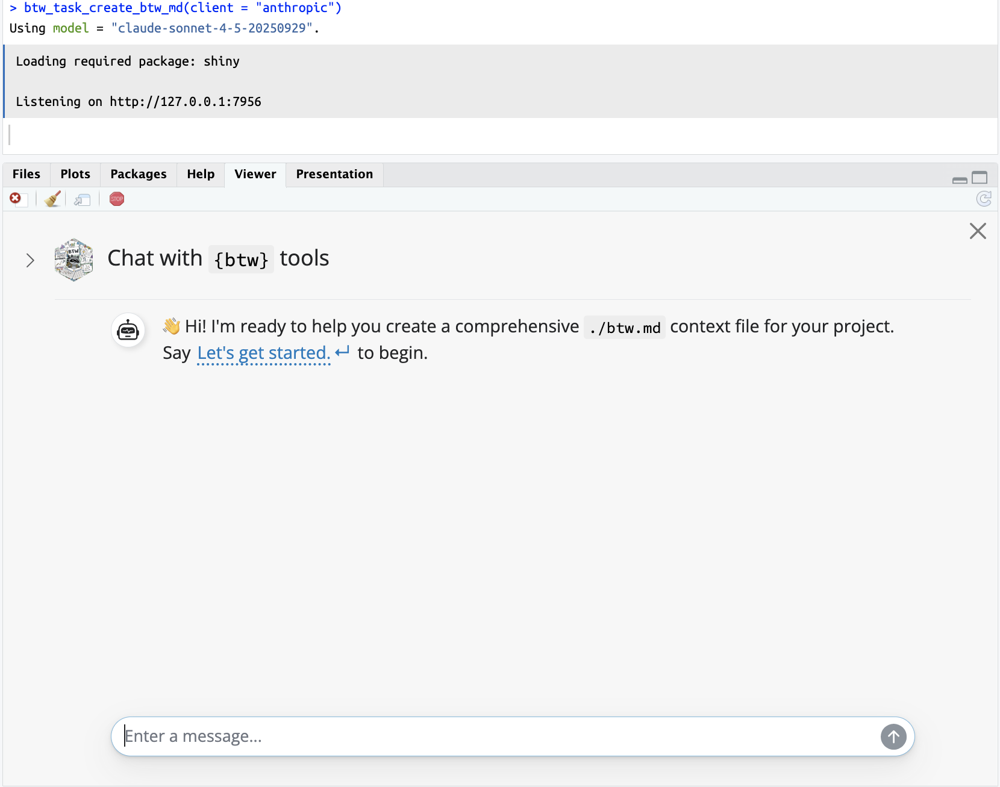
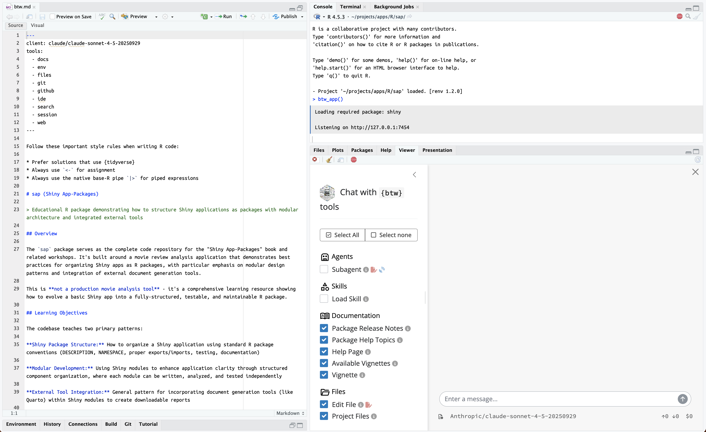
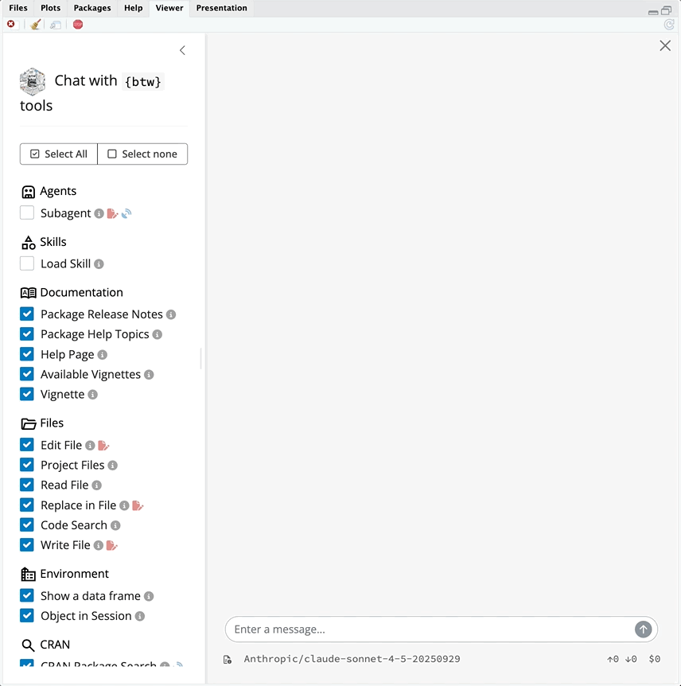

# 🏗 btw {#sec-shiny-btw}

```{r}
#| eval: true 
#| echo: false 
#| include: false
source("_common.R")
```

```{r}
#| label: co_box_dev
#| echo: false
#| results: asis
#| eval: true
co_box(
  color = "y", 
  look = "minimal",
  header = "Alert",
  contents = "The contents for section are being revised. Thank you for your patience."
)
```

In the previous chapters, we used the [`chores` package](https://simonpcouch.github.io/chores/index.html) to develop helpers—pre-written prompts—for repetitive tasks such as creating `roxygen2` documentation and updating `testthat` tests.[^btw-1] In the [`gander` chapter](https://simonpcouch.github.io/gander/index.html), we used the addin to send code and environment context to the LLM.[^btw-2]

[^btw-1]: The [prompt directory](https://simonpcouch.github.io/chores/articles/custom.html#the-prompt-directory) is where `chores` stores the helpers used in the addin.

[^btw-2]: This is explained in [What is gander actually doing?](https://simonpcouch.github.io/gander/articles/gander.html#what-is-gander-actually-doing)

`chores` and `gander` assist us in automating or enhancing the prompts we submit to the LLM. The addins and shortcuts streamline interactions with the model, providing an experience that resembles a browser interface (as opposed to chatting with `live_console(chat)` or `live_browser()`).

```{r}
#| label: shinypak_apps
#| echo: false
#| results: asis
#| eval: true
shinypak_apps(regex = "^30", branch = "30_llm-btw")
```

In this chapter we'll focus on the [`btw` package](https://posit-dev.github.io/btw/index.html), which is fundamentally different than `chores` and `gander` because it,

> "*provides a default set of tools to to peruse the documentation of packages you have installed, check out the objects in your global environment, and retrieve metadata about your session and platform.*"[^btw-3]

[^btw-3]: This description of `btw` actually comes from the [`mcptools` documentation.](https://posit-dev.github.io/mcptools/index.html)

I'll cover using `btw` to add documentation and improve the contents of the downloadable report in our [`sap` application.](https://github.com/mjfrigaard/sap/tree/30_llm-btw)

## Configuration {#sec-btw-config}

Install `ellmer` and `btw`:

```{r}
#| eval: false 
#| code-fold: false
install.packages('ellmer')
# or the dev version
pak::pak('tidyverse/ellmer')
```

```{r}
#| eval: false 
#| code-fold: false
install.packages("btw")
# or the dev version
# install.packages("pak")
pak::pak("posit-dev/btw")
```

We can place the `btw` configuration options in the `.Rprofile` (similar to other [`ellmer` configurations](https://ellmer.tidyverse.org/reference/chat_anthropic.html)).[^btw-4] Recall that the `.Rprofile` file can exist at the user and/or the project-level.

[^btw-4]: You can easily open this file with [`usethis::edit_r_profile()`.](https://usethis.r-lib.org/reference/edit.html)

For example, I've added a project-level `.Rprofile` file this branch of the `sap` package and included a `system_prompt` and `model`:

```{r}
#| eval: false 
#| code-fold: false
if (interactive()) { # <1>
  require(ellmer, quietly = TRUE)
} # <1>
if (interactive()) { # <2>
  require(btw, quietly = TRUE)
} # <2>
options(
  btw.client = ellmer::chat_anthropic( #<3>
    system_prompt = #<4>
    "You are an expert R/Python programmer who loves explaining complex topics to non-technical audiences. 
    ...", #<4>
    model = "claude-sonnet-4-5-20250929" #<5>
    ) #<3>
)
```

1.  Ensure `ellmer` package\
2.  Ensure `btw` package\
3.  `btw` config\
4.  System prompt for all conversations with chat\
5.  `model` argument for most current Claude model

I've included the full system prompt below in an easier to read format:

```` markdown

"You are an expert R/Python programmer who loves explaining complex topics to non-technical audiences. 
  - When writing R code, use base R functions, but follow the tidyverse style guide.     
  - Avoid using `for` loops and prefer functional programming patterns like `apply()` or `purrr`.    
  - When creating graphs/plots, use `ggplot2`.
  - When returning bash/shell commands, give each command their own code chunk (see example below): 
    
    **DON'T DO THIS**: 

      ```bash
      # Check the user's shell
      getent passwd abc1
  
      # Check SSH daemon logs for connection details
      sudo tail -50 /var/log/secure | grep abc1
  
      # Check if rsync is installed and accessible
      which rsync
      ```

    **DO THIS**:

      Check the user's shell:
  
      ```bash
      getent passwd abc1
      ```
  
      Check SSH daemon logs for connection details:
  
      ```bash
      sudo tail -50 /var/log/secure | grep abc1
      ```
  
      Check if rsync is installed and accessible:
  
      ```bash
      which rsync
      ``` 

  - If your response includes markdown, RMarkdown, or Quarto syntax, wrap the contents in tilde blocks (`~~~`). See the example below:
  
        ~~~
  
        ---
        title: 'Report'
        output: html_document
        ---
  
        ```/{r setup, include=FALSE/}
        knitr::opts_chunk$set(echo = TRUE)
        install.packages('tidyverse')
        ```
  
        ## Analysis
  
        Example analysis...
  
        ```/{r analysis/}
        library(tidyverse)
        # ...
        ```
  
        ~~~

  - If writing R Shiny code, use `bslib` for all layout functions (unless explicitly  instructed otherwise).
  - If writing Python Shiny code, use shiny core (not express) to build apps and include explanations in comments."
````

```{r}
#| label: co_box_prompt
#| echo: false
#| results: asis
#| eval: true
co_box(
  color = "b", 
  look = "minimal",
  header = "NOTE",
  contents = "The instructions for returning Markdown/R Markdown/Quarto responses are important for this particular app, as you'll see below."
)
```

```{r}
#| label: git_box_30_llm-btw
#| echo: false
#| results: asis
#| eval: true
git_margin_box(
  contents = "launch",
  fig_pw = '65%', 
  branch = "30_llm-btw", 
  repo = 'sap')
```

## `btw` tools {#sec-shiny-btw-tools}

`btw` comes with a set of pre-defined tools for examining package documentation, environments, directories and files, git and GitHub, our development environment, CRAN packages, R sessions, and general web searches.[^btw-5]

[^btw-5]: Read a complete list of available tools from `btw` in the [package documentation.](https://posit-dev.github.io/btw/reference/btw_tools.html)

We can use `btw` to work interactively in RStudio {height="25"} console by creating a [`btw`-enhanced](https://posit-dev.github.io/btw/reference/btw_client.html) chat client and passing messages directly.[^btw-6]

[^btw-6]: An [`ellmer::Chat` client](https://ellmer.tidyverse.org/reference/Chat.html) which provides a "*sequence of user and assistant [Turns](https://ellmer.tidyverse.org/reference/Turn.html) sent to a specific [Provider.](https://ellmer.tidyverse.org/reference/Provider.html)*"

```{r}
#| eval: false 
#| code-fold: false
chat <- btw_client()
```

We can view the `btw` enhancements by examining the chat object in the console:

```{r}
#| eval: false 
#| code-fold: false
chat
```

`btw` has added 'System and Session Context' and 'Tools' sections to the `chat` client.



We can see the model will have some additional instructions and methods at it's disposal (beyond what we've provided in the `system_prompt` argument of `ellmer::chat_anthropic()`).

:::: {.callout-note collapse="true" appearance="minimal" icon="false"}
### [`btw` tool functions]{style="font-weight: bold; font-size: 1.15em;"}

::: {style="font-size: 1.10em; color: #282b2d;"}
All `btw` functions follow the name convention below:

| Prefix | Group | Name |
|------------------------|------------------------|------------------------|
| `btw_tool_` | `files_` | [code_search()](https://posit-dev.github.io/btw/reference/btw_tool_files_code_search.html) |
| `btw_tool_` | `files_` | [list_files()](https://posit-dev.github.io/btw/reference/btw_tool_files_list_files.html) |
| `btw_tool_` | `files_` | [read_text_file()](https://posit-dev.github.io/btw/reference/btw_tool_files_read_text_file.html) |
| `btw_tool_` | `files_` | [write_text_file()](https://posit-dev.github.io/btw/reference/btw_tool_files_write_text_file.html) |

The **Group** can be one of `docs`, `env`, `git`, `github`, `ide`, `search`, `session` or `web`. This is important to remember below in @sec-btw-app
:::
::::

## The [`btw.md`]{style="font-weight: bold; font-size: 1.15em;"} context file {#sec-shiny-btw-md}

As we learned in the [`ellmer` chapter](ellmer.qmd), project prompts should be stored in `inst/prompts/`. `btw` also provides the [`use_btw_md()` function](https://posit-dev.github.io/btw/reference/use_btw_md.html), which creates a project 'context file.'

```{r}
#| eval: false 
#| code-fold: false
use_btw_md(scope = "project")
```

```{verbatim}
ℹ See btw::btw_client for format details
ℹ See btw::btw_tools for available tools
ℹ Call `btw::btw_task_create_btw_md()` to use an LLM to help you initialize the project context.
```

The `btw.md` file comes with some default content for project context:

> "*Use `btw.md` to inform the LLM of your preferred code style, to provide domain-specific terminology or definitions, to establish project documentation, goals and constraints, to include reference materials such or technical specifications, or more. Storing this kind of information in `btw.md` may help you avoid repeating yourself and can be used to maintain coherence across many chat sessions.*"

### [`client`]{style="font-size: 1.10em; font-weight: bold;"} {.unnumbered}

The YAML header in our newly created `btw.md` is where can specify the `client` (along with the `provider` and `model`).

``` yaml
---
client: claude/claude-sonnet-4-5-20250929
---
```

The default values in `btw.md` will automatically use the latest Claude model from Anthropic. The YAML values above are similar to using `ellmer`'s `chat_*` functions.[^btw-7]

[^btw-7]: For more information on `client` values, read the [Chat Settings documentation](https://posit-dev.github.io/btw/reference/use_btw_md.html#chat-settings).

### [`tools`]{style="font-size: 1.10em; font-weight: bold;"} {.unnumbered}

The `tools` section of the YAML header contains a list of the groups from [`btw_tools()`](https://posit-dev.github.io/btw/reference/btw_tools.html). Each of these groups contains a collection of functions "*that allow the chat to interface with your computational environment.*"

``` yaml
---
tools:
  - docs
  - env
  - files
  - git
  - github
  - ide
  - search
  - session
  - web
---
```

Additional instructions are also provided on code style:

``` markdown
Follow these important style rules when writing R code:

* Prefer solutions that use {tidyverse}
* Always use `<-` for assignment
* Always use the native base-R pipe `|>` for piped expressions
```

Now that we have a `btw.md` file for project context, we'll start an interactive chat session to help us write our context file.

## Console chat {#sec-console-btw-task-create-btw-md}

We can use the `btw` tools to add more project context to the `btw.md` by calling [`btw_task_create_btw_md()`](https://posit-dev.github.io/btw/reference/btw_task_create_btw_md.html) and setting the `mode` to `"console"`.

```{r}
#| eval: false 
#| code-fold: false
btw_task_create_btw_md(mode = "console", client = "anthropic")
```

This opens an interactive chat in the console:

{width="100%" fig-align="center"}

## How tool calling works {#sec-how-tool-calls-work}

LLMs can't execute R code, but if we've registered tools (i.e., R functions) with the model, they can be used to help provide additional information.

As mentioned above, `btw` has a collection of tools at our disposal, so when we start the interactive chat, the model informs us it will be examining the `sap` package contents for more information.

```{bash}
#| eval: false 
#| code-fold: false
>>> "Let's get started."
```

The model tells us it's intentions for the `btw.md` file:

``` markdown
I'll begin by exploring the project structure to understand 
what we're working with.
```

To perform this exploration, the model will use the registered tools from `btw`.

### Registered tools

When registering a tool with an LLM, we include the name of the function, a description of what the function does, and a list of function arguments with their type (boolean, integer, number, etc.). [^btw-8]

[^btw-8]: We can register tools using `ellmer`'s [`create_tool_def()` and `tool()` functions](https://ellmer.tidyverse.org/articles/tool-calling.html#registering-and-using-tools).

We can view all the tools registered with the LLM using:

```{r}
#| eval: false 
#| code-fold: false
chat$get_tools()
```

```{r}
#| label: co_box_btw_tools_vs_get_tools
#| echo: false
#| results: asis
#| eval: false
co_box(
  color = "b", 
  look = "minimal",
  header = "Note",
  contents = "The `btw_tools()` function lists all the tools we *could register*, but `chat$get_tools()` returns the tools that *are registered* with the model. "
)
```

:::: {.callout-note collapse="true" appearance="minimal" icon="false"}

### [Note]{style="font-weight: bold; font-size: 1.15em;"}

::: {style="font-size: 1.10em; color: #282b2d;"}
The `btw_tools()` function lists all the tools we *could register*, but `chat$get_tools()` returns the tools that *are registered* with the model.
:::

::::

The output from `chat$get_tools()` is rather lengthy, but we can use <kbd>Ctrl</kbd>/<kbd>Cmd</kbd> + <kbd>F</kbd> to locate `btw_tool_files_list()`, which is the first tool called by the LLM.

```{verbatim}
$btw_tool_files_list
# <ellmer::ToolDef> btw_tool_files_list(path, type, regexp, `_intent`)
# @name: btw_tool_files_list
# @description: List files or directories in the project.

WHEN TO USE:
* Use this tool to discover the file structure of a project.
* When you want to understand the project structure, use `type = "directory"` 
  to list all directories.
* When you want to find a specific file, use `type = "file"` and `regexp` to
  filter files by name or extension.

CAUTION: Do not list all files in a project, instead prefer listing files in
a specific directory with a `regexp` to filter to files of interest.
```

View the entire output from `chat$get_tools()` in [`inst/prompts/btw-chat-get-tools.md`](https://github.com/mjfrigaard/sap/blob/30_llm-btw/inst/prompts/btw-chat-get-tools.md).

### Tool calls

Recall the model was going to start by ***'`exploring your project structure`'***, and we can see this aligns with the' `WHEN TO USE` section of `btw_tool_files_list()`.

> WHEN TO USE:
>
> -   Use this tool to discover the file structure of a project.
>
> -   When you want to understand the project structure, use `type = "directory"` to list all directories.
>
> -   When you want to find a specific file, use `type = "file"` and `regexp` to filter files by name or extension.

In the console, the tool call and a preview of it's results are printed. Below is the first call to `btw_tool_files_list()`:

```{verbatim}
◯ [tool call] btw_tool_files_list(path = ".", 
`_intent` = "List root directory to identify project type and structure")
```

The function includes an `_intent` argument, where the model, "*explain\[s\] why it called the tool.*"[^btw-9]

[^btw-9]: The [`_intent` argument](https://posit-dev.github.io/btw/reference/btw_tool_files_list_files.html#arg--intent) is "*An optional string describing the intent of the tool use. When the tool is used by an LLM, the model will use this argument to explain why it called the tool.*"

### Tool results

The results are a markdown formatted table of the project contents (file/folder names, their size, and when they were last changed):[^btw-10]

[^btw-10]: I've cleaned up the formatting on this markdown table so it's easier to read.

```{verbatim}
● #> | path        | type      | size  | modification_time   |
  #> |-------------|-----------|-------|---------------------|
  #> | DESCRIPTION | file      | 533   | 2026-04-01 08:47:33 |
  #> | NAMESPACE   | file      | 977   | 2026-04-01 08:47:33 |
  #> | R           | directory | 1.03K | 2026-04-01 08:47:33 |
  #> …
```

### Model response

The table output is sent to the LLM, which them provides a summary of the contents:

``` markdown
Great! This is clearly an **R package** for building a Shiny application. 
```

I've created an overview of this tool call in the diagram below.[^btw-11]

[^btw-11]: This image was inspired by the [tool calling overview](https://pkg.garrickadenbuie.com/genAI-2025-llms-meet-shiny/#/section-14) presented in Garrick Aden-Buie's [genAI 2025: Using LLMs in Shiny](https://github.com/gadenbuie/genAI-2025-llms-meet-shiny) presentation.

{width="100%" fig-align="center"}

The model is equipped with the supplemented system prompt--which informs it of the tools at it's disposal--and when we begin, it starts by attempting to understand the project structure.

This objective matches the `btw` registered tool description for the `btw_tool_files_list()` function, which returns a markdown-formatted table of the project contents. The results from the tool are sent to the LLM, which provides a summary in the console.

The entire [**PHASE 1: PROJECT EXPLORATION**](https://github.com/mjfrigaard/sap/blob/30_llm-btw/inst/prompts/btw-md-conversation.md#phase-1-project-exploration) is in the callout box below (expand the callout box to view).

:::: {.callout-caution collapse="true" appearance="minimal" icon="false"}
## [PHASE 1: PROJECT EXPLORATION (TOOL CALLS)]{style="font-weight: bold; font-size: 1.15em;"}

::: {style="font-size: 1.10em; font-style: italic; color: #282b2d;"}

:::
::::

As we can see, the model called `btw_tool_files_read()` and `btw_tool_docs_available_vignettes()` to gather context on the project.

The [**PPHASE 1 COMPLETE - Summary of Findings**](https://github.com/mjfrigaard/sap/blob/30_llm-btw/inst/prompts/btw-md-conversation.md#phase-1-complete---summary-of-findings) is what the model learned about the `sap` package using the `btw` tools (expand the callout box to view):

:::: {.callout-caution collapse="true" appearance="minimal" icon="false"}
## [PHASE 1 COMPLETE - Summary of Findings]{style="font-weight: bold; font-size: 1.15em;"}

::: {style="font-size: 1.10em; font-style: italic; color: #282b2d;"}

:::
::::

After the project summary, the model starts [**PHASE 2: QUESTIONS FOR CONTEXT**](https://github.com/mjfrigaard/sap/blob/30_llm-btw/inst/prompts/btw-md-conversation.md#phase-2-questions-for-context), which includes a series of questions from the LLM regarding the context of the package/project (expand the callout box to view).

:::: {.callout-caution collapse="true" appearance="minimal" icon="false"}
## [PHASE 2: QUESTIONS FOR CONTEXT]{style="font-weight: bold; font-size: 1.15em;"}

::: {style="font-size: 1.10em; font-style: italic; color: #282b2d;"}

:::
::::

I included some instructions to the model on building `mermaid` diagrams for the `btw.md` file. The [**PHASE 2: NARRATIVE CONSTRUCTION**](https://github.com/mjfrigaard/sap/blob/30_llm-btw/inst/prompts/btw-md-conversation.md#phase-2-narrative-construction) returned after the questions and answers is below (expand the callout box to view).

:::: {.callout-caution collapse="true" appearance="minimal" icon="false"}
## [PHASE 2: NARRATIVE CONSTRUCTION]{style="font-weight: bold; font-size: 1.15em;"}

::: {style="font-size: 1.10em; font-style: italic; color: #282b2d;"}



:::
::::

## Updated `bwd.md` file

When **Phase 2** is complete, we're told we have a "*comprehensive `btw.md` file that captures the essential information about \[our\] Shiny App-Packages project*." The full conversation with the model is stored in [`inst/prompts/btw-md-conversation.md`](https://github.com/mjfrigaard/sap/blob/30_llm-btw/inst/prompts/btw-md-conversation.md).

View the complete [updated `btw.md` file on GitHub.](https://github.com/mjfrigaard/sap/blob/30_llm-btw/btw.md#sap-shiny-app-packages)

## [`btw`]{style="font-weight: bold; font-size: 1.15em;"} App {#sec-btw-app}

Now that we have a project context file, we will use `btw` to improve our downloadable report. Instead of using the console to chat with the model, we'll use the `btw` app:[^btw-12]

[^btw-12]: To run the `btw_app()`, make sure you have the latest version of [`shinychat`](https://posit-dev.github.io/shinychat/r/index.html).

```{r}
#| eval: false 
#| code-fold: false
btw_app()
```

{width="100%" fig-align="center"}

If we expand the sidebar, we can see the registered tools provided by `btw`:

{width="100%" fig-align="center"}

By default, the app includes all of the tools available from `btw` (with the exception of **Subagent**, **Load skill**, and **Package Tools**).[^btw-13]

[^btw-13]: **Subagent** uses [SOURCE](https://posit-dev.github.io/btw/reference/btw_tool_files_code_search.html), **Load skill** uses [SOURCE](https://posit-dev.github.io/btw/reference/btw_tool_files_code_search.html), **Package Tools** uses [SOURCE](https://posit-dev.github.io/btw/reference/btw_tool_files_code_search.html)

### Agents 

If you're new to LLMs, `btw` somewhat drops you in the deep end of the pool. As we can see from the App interface, we're able to add a **Subagent** to the available tools.

{width=90% fig-align="center"}

#### *What is the difference between an agent and a subagent?* {.unnumbered}

Generally speaking, an **Agent** is an LLM chat session that uses tools autonomously to complete tasks. A **Subagent** is a specialized tool the Agent can delegate subtasks to—like a manager (*Agent*) assigning work to a specialist (*Subagent*).

```{=html}
<style>

.codeStyle span:not(.nodeLabel) {
  font-family: monospace;
  font-size: 1.5em;
  font-weight: bold;
  color: #9753b8 !important;
  background-color: #f6f6f6;
  padding: 0.2em;
}
</style>
```

```{mermaid}
%%| fig-cap: 'Agents vs. subagents'
%%| fig-align: center
%%{init: {'theme': 'neutral', 'themeVariables': { 'fontFamily': 'monospace', "fontSize":"16px"}}}%%

flowchart TD
    User(User) -->|prompt| Agt("Agent<br>(LLM + tools)")
    Agt -->|delegates subtask| SubAgt("Subagent<br>(tool-shaped agent)")
    SubAgt -->|result| Agt
    Agt -->|final response| User
    
```

### Skills 

### Package Tools

### Using the app

The `btw_app()` functions like any LLM chat interface.


