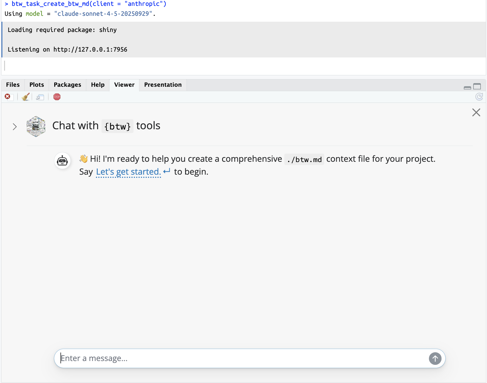
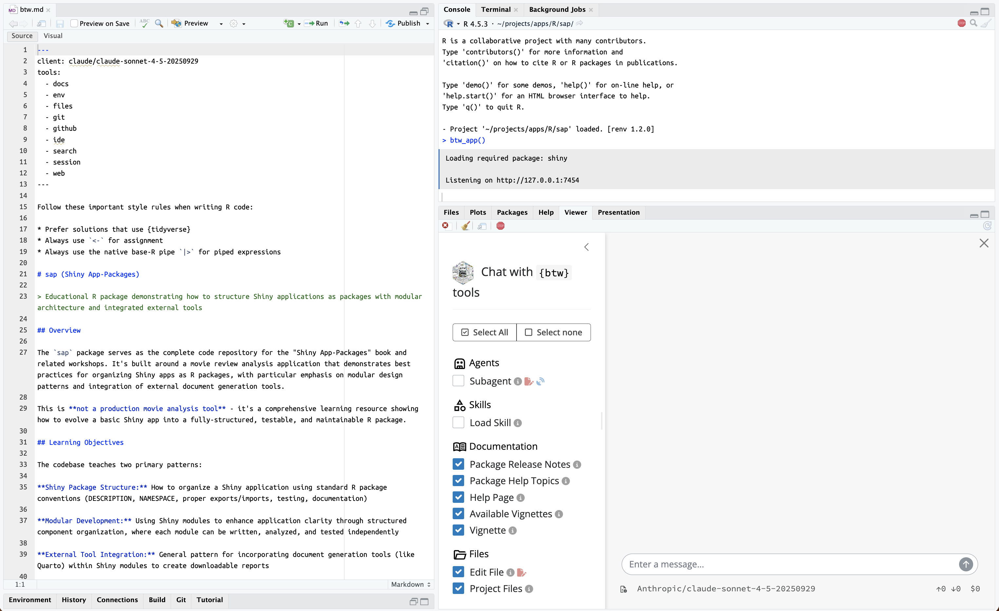
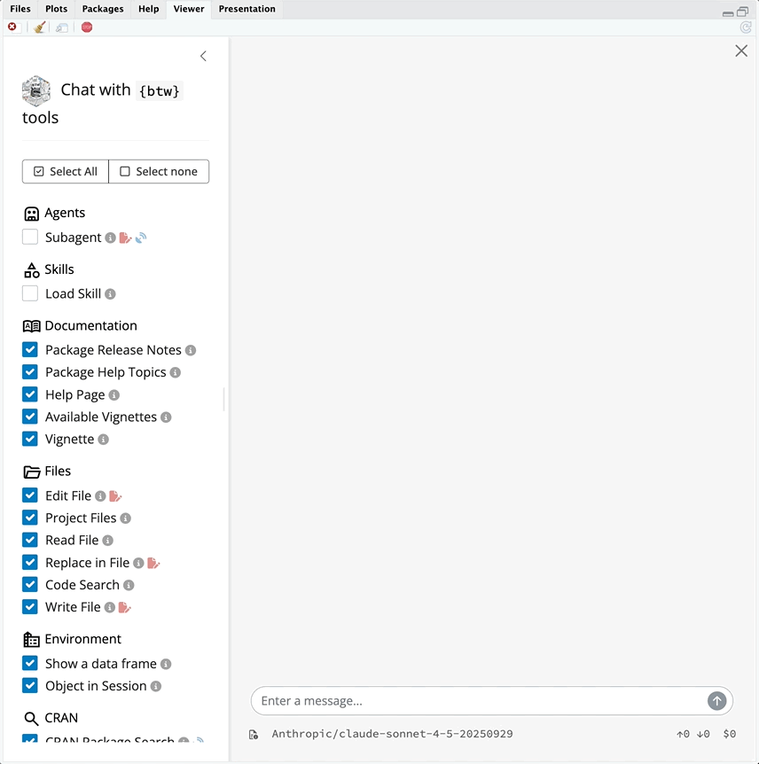
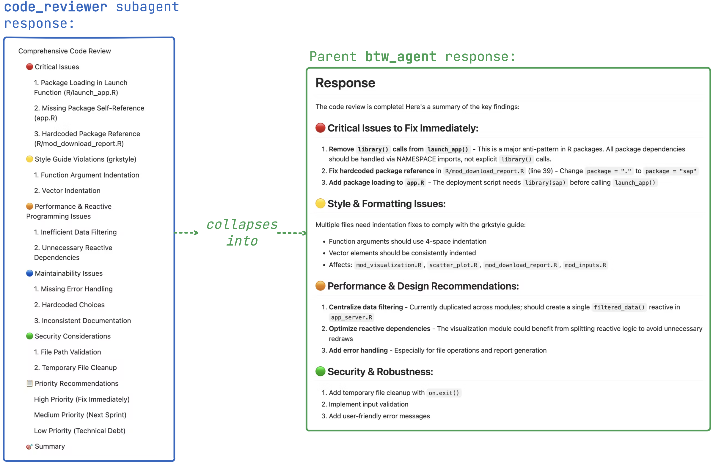

# 🏗 btw {#sec-shiny-btw}

```{r}
#| eval: true 
#| echo: false 
#| include: false
source("_common.R")
```

```{r}
#| label: co_box_dev
#| echo: false
#| results: asis
#| eval: true
co_box(
  color = "y", 
  look = "minimal",
  header = "Alert",
  contents = "The contents for section are being revised. Thank you for your patience."
)
```

We previously used the [`chores` package](https://simonpcouch.github.io/chores/index.html) to develop helpers—pre-written prompts—for repetitive tasks such as creating `roxygen2` documentation and updating `testthat` tests.[^btw-1] In the [`gander` chapter](https://simonpcouch.github.io/gander/index.html), we used an addin to send code and the IDE/environment context to the LLM.[^btw-2]

[^btw-1]: The [prompt directory](https://simonpcouch.github.io/chores/articles/custom.html#the-prompt-directory) is where `chores` stores the helpers used in the addin.

[^btw-2]: This is explained in [What is gander actually doing?](https://simonpcouch.github.io/gander/articles/gander.html#what-is-gander-actually-doing)

Both `chores` and `gander` assist us in automating and enhancing the prompts we're sending to the LLM. These packages use addins and/or shortcuts to streamline prompts, provide additional context, and creates an experience that doesn't require us to leave our development environment.[^live-console-chat]

[^live-console-chat]: The addins are an improvement over chatting with `live_console(chat)` or `live_browser()`.

In this chapter we'll focus on the [`btw` package](https://posit-dev.github.io/btw/index.html), which is fundamentally different than `chores` and `gander` because it,

> "*provides a default set of tools to to peruse the documentation of packages you have installed, check out the objects in your global environment, and retrieve metadata about your session and platform.*"[^btw-3]

[^btw-3]: This description of `btw` actually comes from the [`mcptools` documentation.](https://posit-dev.github.io/mcptools/index.html)

I'll cover using `btw` to improve the documentation and contents of the downloadable report in our [`sap` application.](https://github.com/mjfrigaard/sap/tree/30_llm-btw)

```{r}
#| label: shinypak_apps
#| echo: false
#| results: asis
#| eval: true
shinypak_apps(regex = "^30", branch = "30_llm-btw")
```

## Configuration {#sec-btw-config}

Install `ellmer` and `btw`:

```{r}
#| eval: false 
#| code-fold: false
install.packages('ellmer')
# or the dev version
pak::pak('tidyverse/ellmer')
```

```{r}
#| eval: false 
#| code-fold: false
install.packages("btw")
# or the dev version
# install.packages("pak")
pak::pak("posit-dev/btw")
```

We can place the `btw` configuration options in the `.Rprofile` (similar to other [`ellmer` configurations](https://ellmer.tidyverse.org/reference/chat_anthropic.html)).[^btw-4] 

[^btw-4]: Recall that the `.Rprofile` file can exist at the user and/or the project-level. You can easily open this file with [`usethis::edit_r_profile()`.](https://usethis.r-lib.org/reference/edit.html)

I've added a project-level [`.Rprofile` file](https://github.com/mjfrigaard/sap/blob/30_llm-btw/.Rprofile) this branch of the `sap` package and included a `system_prompt` and `model`:

```{r}
#| eval: false 
#| code-fold: false
if (interactive()) { # <1>
  require(ellmer, quietly = TRUE)
} # <1>
if (interactive()) { # <2>
  require(btw, quietly = TRUE)
} # <2>
options(
  btw.client = ellmer::chat_anthropic( #<3>
    system_prompt = #<4>
    "You are an expert R/Python programmer who loves explaining complex topics to non-technical audiences. 
    ...", #<4>
    model = "claude-sonnet-4-5-20250929" #<5>
    ) #<3>
)
```

1.  Ensure `ellmer` package\
2.  Ensure `btw` package\
3.  `btw` config\
4.  System prompt for all conversations with chat\
5.  `model` argument for most current Claude model

I've included the full system prompt below in an easier to read format:

::: {.callout-note collapse='true' appearance='minimal' icon=false}

## [Full system prompt]{style='font-weight: bold; font-size: 1.05em;'}

::: {style='font-size: 0.95em; color: #282b2d;'}

The instructions for returning Markdown/R Markdown/Quarto responses are important for this particular app, as you'll see below.
  


::: 

:::


```{r}
#| label: git_box_30_llm-btw
#| echo: false
#| results: asis
#| eval: true
git_margin_box(
  contents = "launch",
  fig_pw = '65%', 
  branch = "30_llm-btw", 
  repo = 'sap')
```

## Context files

Along with a system prompt, we'll want to introduce a comprehensive context file.[^standardize-context] Context files are markdown documents located in the root directory (similar to` README.md` files) that agents read automatically before doing work. Generally speaking, these files answer the question, "*What do I need to know to be productive?*"

Think of these docs as the LLM's analogue of an onboarding document for a new developer on your team. Good things to include are the project's purpose, audience, conventions and constraints (i.e., gotchas, "*don't touch X*", etc.). Without any context, the LLM has to "rediscover" the project on every session, which wastes tokens because the model has to spend at least a few turns exploring the project's files. `btw` comes with it's own context file, [`btw.md`](https://posit-dev.github.io/btw/reference/btw_client.html#project-context).[^previous-context-file] 

::: {.callout-tip collapse="false" appearance="minimal" icon="false"}

### [Various context files]{style="font-weight: bold; font-size: 1.15em;"}

::: {style="font-size: 1.10em; color: #282b2d;"}

Context files have different names depending on the tool, but the role is the same:

| **Tool**         | **Filename**                        |
| ---------------- | ----------------------------------- |
| Claude Code      | `CLAUDE.md`                         |
| Cursor           | `.cursorrules / .cursor/rules/*.md` |
| OpenAI Codex CLI | `AGENTS.md`                         |
| GitHub Copilot   | `.github/copilot-instructions.md`   |
| `btw`            | `btw.md`                            |

:::

:::


Let's view the system and session context *without* a `btw.md` (or other context file). In the RStudio {height="25"} **Console**, we'll use `btw_client()` to create a  [`btw`-enhanced](https://posit-dev.github.io/btw/reference/btw_client.html) chat client.[^btw-6]

[^standardize-context]: There is a push to [standardize these files](https://llmstxt.org/) across platforms. 

[^previous-context-file]: If you're already using a context file (i.e., `AGENTS.md` or `llms.txt`), these can be configured with in `btw_client()`. 

[^btw-6]: An [`ellmer::Chat` client](https://ellmer.tidyverse.org/reference/Chat.html) which provides a "*sequence of user and assistant [Turns](https://ellmer.tidyverse.org/reference/Turn.html) sent to a specific [Provider.](https://ellmer.tidyverse.org/reference/Provider.html)*"

```{r}
#| eval: false 
#| code-fold: false
chat <- btw_client()
```

We can view the `btw` enhancements by examining the `chat` object in the console:

```{r}
#| eval: false 
#| code-fold: false
chat
```

::: {.callout-note collapse="true" appearance="minimal" icon="false"}

### [Expand to view `chat`]{style="font-weight: bold; font-size: 1.15em;"}



:::

We can see `btw` has added sections for tools and skills *before* the system prompt we provided in [`ellmer::chat_anthropic()`](https://ellmer.tidyverse.org/reference/chat_anthropic.html) (we will cover tools and skills in more depth below). We can already see the benefit of having the system prompt loaded in the context because the model already has our instructions on the first turn (and we've spent `$0`). 

## [`btw`]{style="font-weight: bold; font-size: 1.15em;"} tools {#sec-btw-tools}

Broadly speaking, **tools** are functions a model can call. Tools have a name, description, and will run code that returns a result (i.e., list files and folders, read a file, execute R). Tools are always present in the model's context — the model sees the full list and picks one when needed.

`btw` comes with a set of pre-defined tools for examining package documentation, environments, directories and files, git and GitHub, our development environment, CRAN packages, R sessions, and general web searches.[^btw-5]

[^btw-5]: Read a complete list of available tools from `btw` in the [package documentation.](https://posit-dev.github.io/btw/reference/btw_tools.html)

::: {.callout-note collapse="true" appearance="minimal" icon="false"}

### [`btw` tool functions]{style="font-weight: bold; font-size: 1.15em;"}

::: {style="font-size: 1.10em; color: #282b2d;"}

All `btw` functions follow the name convention below:

| Prefix | Group | Name |
|------------------------|------------------------|------------------------|
| `btw_tool_` | `files_` | [code_search()](https://posit-dev.github.io/btw/reference/btw_tool_files_code_search.html) |
| `btw_tool_` | `files_` | [list_files()](https://posit-dev.github.io/btw/reference/btw_tool_files_list_files.html) |
| `btw_tool_` | `files_` | [read_text_file()](https://posit-dev.github.io/btw/reference/btw_tool_files_read_text_file.html) |
| `btw_tool_` | `files_` | [write_text_file()](https://posit-dev.github.io/btw/reference/btw_tool_files_write_text_file.html) |

The **Group** can be one of `docs`, `env`, `git`, `github`, `ide`, `search`, `session` or `web`. 

:::

:::

## [`btw.md`]{style="font-weight: bold; font-size: 1.15em;"} {#sec-shiny-btw-md}

[`use_btw_md()` function](https://posit-dev.github.io/btw/reference/use_btw_md.html) will create a boilerplate `btw.md` file.

```{r}
#| eval: false 
#| code-fold: false
use_btw_md(scope = "project")
```

```{verbatim}
ℹ See btw::btw_client for format details
ℹ See btw::btw_tools for available tools
ℹ Call `btw::btw_task_create_btw_md()` to use an LLM to help you initialize the project context.
```

This includes some default content for the project context:

> "*Use `btw.md` to inform the LLM of your preferred code style, to provide domain-specific terminology or definitions, to establish project documentation, goals and constraints, to include reference materials such or technical specifications, or more. Storing this kind of information in `btw.md` may help you avoid repeating yourself and can be used to maintain coherence across many chat sessions.*"

The YAML header in our newly created `btw.md` is where can specify the `client` (along with the `provider` and `model`).

``` yaml

---
client: claude/claude-sonnet-4-5-20250929
---

```

The default values in `btw.md` will automatically use the latest Claude model from Anthropic. The YAML values above are similar to using `ellmer`'s `chat_*` functions.[^btw-7]

[^btw-7]: For more information on `client` values, read the [Chat Settings documentation](https://posit-dev.github.io/btw/reference/use_btw_md.html#chat-settings).

The `tools` section of the YAML header contains a list of the groups from [`btw_tools()`](https://posit-dev.github.io/btw/reference/btw_tools.html). Each of these groups contains a collection of functions "*that allow the chat to interface with your computational environment.*"

``` yaml
---
tools:
  - docs
  - env
  - files
  - git
  - github
  - ide
  - search
  - session
  - web
---
```

Additional instructions are also provided on code style:

``` markdown
Follow these important style rules when writing R code:

* Prefer solutions that use {tidyverse}
* Always use `<-` for assignment
* Always use the native base-R pipe `|>` for piped expressions
```

## Creating `btw.md` {#sec-create-btw-md}

We'll want to improve our generic `btw.md` context file. As the output above mentioned, we can call [`btw_task_create_btw_md()`](https://posit-dev.github.io/btw/reference/btw_task_create_btw_md.html) to start an interactive chat session to help us write our context file.[^storing-prompts]

[^storing-prompts]: The prompts used in this project are stored in `inst/prompts/` (as we learned in the [`ellmer` chapter](ellmer.qmd)). 

```{r}
#| eval: false 
#| code-fold: false
btw_task_create_btw_md(client = "anthropic")
```

This opens an interactive chat in the **Viewer** pane:

{width="100%" fig-align="center"}


## How tool calling works {#sec-how-tool-calls-work}

When we start the interactive chat, the model informs us it will be examining the `sap` package contents for more information.

``` markdown
I'll begin by exploring the project structure to understand 
what we're working with.
```

The model can't execute R code, but `btw` has "registered" a collection of tools (i.e., R functions) with the model, these can be used to help provide additional information. In other words, the `btw_task_create_btw_md()` function uses the tools in `btw` to add more project context to the `btw.md` file. 

::: {.callout-note collapse="true" appearance="minimal" icon="false"}

### [Registered vs. registering tools]{style="font-weight: bold; font-size: 1.15em;"}

::: {style="font-size: 1.10em; color: #282b2d;"}

The `btw_tools()` function lists all the tools we *could register*, but `chat$get_tools()` returns the tools that *are registered* with the model.

If we want to register a tool, we include the name of the function, a description of what the function does, and a list of function arguments with their type (boolean, integer, number, etc.). [^btw-8]

[^btw-8]: We can register tools using `ellmer`'s [`create_tool_def()` and `tool()` functions](https://ellmer.tidyverse.org/articles/tool-calling.html#registering-and-using-tools).

:::

:::

### Registered tools

Let's back up and take a look at the tools `btw` has registered with `get_tools()`:

```{r}
#| eval: false 
#| code-fold: false
chat$get_tools()
```

Each registered tool has a `@name` and `@description` parameter, with `WHEN TO USE` instructions written in markdown. 

Recall the model was going to start by "*exploring your project structure*", and we can see this aligns with the `WHEN TO USE` section of `btw_tool_files_list()`:

```{verbatim}
$btw_tool_files_list
# <ellmer::ToolDef> btw_tool_files_list(path, type, regexp, `_intent`)
# @name: btw_tool_files_list
# @description: List files or directories in the project.

WHEN TO USE:
* Use this tool to discover the file structure of a project.
* When you want to understand the project structure, use `type = "directory"` 
  to list all directories.
* When you want to find a specific file, use `type = "file"` and `regexp` to
  filter files by name or extension.

CAUTION: Do not list all files in a project, instead prefer listing files in
a specific directory with a `regexp` to filter to files of interest.
```

::: {.callout-tip collapse="true" appearance="minimal" icon="false"}

### [`get_tools()` output]{style="font-weight: bold; font-size: 1.15em;"}

The output from `chat$get_tools()` is rather lengthy, but we can use <kbd>Ctrl</kbd>/<kbd>Cmd</kbd> + <kbd>F</kbd> to locate `btw_tool_files_list()`, which is the first tool called by the LLM.

View the entire output from `chat$get_tools()` in [`inst/prompts/btw-chat-get-tools.md`](https://github.com/mjfrigaard/sap/blob/f46492454c28bbb915df949a76a89cde1a48ddad/inst/prompts/btw-chat-get-tools.md?plain=1#L358).

:::

### Tool calls

In the **Viewer** pane, we can review each tool call and the results. Below is the first call to `btw_tool_files_list()`:

```{r}
#| eval: false 
#| code-fold: false
btw_tool_files_list(path = ".", `_intent` = "List root directory to identify project type and structure")
```

The function includes an `_intent` argument, where the model, "*explain\[s\] why it called the tool.*"[^btw-9]

[^btw-9]: The [`_intent` argument](https://posit-dev.github.io/btw/reference/btw_tool_files_list_files.html#arg--intent) is "*An optional string describing the intent of the tool use. When the tool is used by an LLM, the model will use this argument to explain why it called the tool.*"

### Tool results

The tool returns a markdown-formatted table of the project contents (file/folder names, their size, and when they were last changed):[^btw-10]

[^btw-10]: I've cleaned up the formatting on this markdown table so it's easier to read, but it's an output you might expect from the [`fs` package](https://fs.r-lib.org/). 

```{verbatim}
| path              | type      | size    | modification_time   |
| ----------------- | --------- | ------- | ------------------- |
| DESCRIPTION       | file      | 621     | 2026-04-29 10:34:14 |
| NAMESPACE         | file      | 65      | 2026-04-29 09:46:28 |
| R                 | directory | 352     | 2026-04-29 10:35:32 |
| R/app_server.R    | file      | 689     | 2026-04-29 09:25:01 |
| R/app_ui.R        | file      | 492     | 2026-04-29 10:46:21 |

...omitted...
```

### Model response

The table result is sent to the model, which provides a summary of it's contents:

``` markdown
Perfect! This is clearly an R Package with a Shiny application. 
Let me read the key files to understand the project.
```

### Recap

I've created an overview of this tool call in the diagram below.[^btw-11]

[^btw-11]: This image was inspired by the [tool calling overview](https://pkg.garrickadenbuie.com/genAI-2025-llms-meet-shiny/#/section-14) presented in Garrick Aden-Buie's [genAI 2025: Using LLMs in Shiny](https://github.com/gadenbuie/genAI-2025-llms-meet-shiny) presentation.

{width="100%" fig-align="center"}

The model context begins with our supplemented system prompt--which now includes the tools and skills at it's disposal. When we begin, the model beings by *exploring the project structure*--matching the registered tool description for the `btw_tool_files_list()` function, which returns a table of the project contents. These tool results are sent to the model, and we see the overall summary.

## Building the `btw.md` file

I strongly recommend reading the documentation on creating the `btw.md`.[^btw-init-docs] The instructions are broken into three phases: 

1. Phase 1: Strategic Exploration (Research & Discovery)    
2. Phase 2: Narrative Construction (User Collaboration)   
3. Phase 3: Documentation (File Writing)    

[^btw-init-docs]: Read the entire `btw-init.md` prompt [here](https://github.com/posit-dev/btw/blob/main/inst/prompts/btw-init.md). 

### Phase 1: Strategic Exploration {.unnumbered}

The first phase is the [**Strategic Exploration**](https://github.com/posit-dev/btw/blob/main/inst/prompts/btw-init.md#phase-1-strategic-exploration), and it's goal is to efficiently understand the project's structure, purpose, and technical architecture without overwhelming the context window. This includes using tools to identify key files, review documentation, and tailor the approach to the project type.

The [phase 1 summary](https://github.com/mjfrigaard/sap/blob/30_llm-btw/inst/prompts/setup.md#phase-1-project-exploration) is what the model learned about the `sap` package using the `btw` tools (expand the callout box to view).

::: {.callout-caution collapse="true" appearance="minimal" icon="false"}

### [Phase 1 Summary: Project Understanding]{style="font-weight: bold; font-size: 1.15em;"} {.unnumbered}

::: {style="font-size: 1.10em; font-style: italic; color: #282b2d;"}



:::

:::

The model primarily relied on `btw_tool_files_read()` and `btw_tool_docs_available_vignettes()` to gather context on the project.

### Phase 2: Narrative Construction {.unnumbered}

After the project summary, the model starts with the [**Narrative Construction**](https://github.com/posit-dev/btw/blob/main/inst/prompts/btw-init.md#phase-2-narrative-construction). The overall goal of phase 2 is to collaborate with the user to provide key architectural context and the reasoning behind important design decisions, using brief, developer-focused explanations that aren’t in the existing documentation. 

I've included the [phase 2 questions and answers](https://github.com/mjfrigaard/sap/blob/30_llm-btw/inst/prompts/setup.md#phase-2-gathering-context) below (expand the callout box to view):

::: {.callout-caution collapse="true" appearance="minimal" icon="false"}

### [Phase 2: Gathering Context]{style="font-weight: bold; font-size: 1.15em;"} {.unnumbered}

::: {style="font-size: 1.10em; font-style: italic; color: #282b2d;"}



:::

:::

### Phase 3: Documentation {.unnumbered}

After completing the phase 2, `btw` gives us a chance to review each section of our `btw.md`. You can review the entire conversation in the [`inst/prompts/setup.md` file](https://github.com/mjfrigaard/sap/blob/30_llm-btw/inst/prompts/setup.md#phase-3-documentation).

When **Phase 2** is complete, we're told we have a "*comprehensive `btw.md` file*" that is "*structured from narrative (purpose and architecture) to reference material (technical details and workflows), making it easy for new developers to get oriented quickly while also serving as a practical guide for working with the project*".

::: {.callout-caution collapse="true" appearance="minimal" icon="false"}

### [Phase 3: Write Comprehensive `btw.md`]{style="font-weight: bold; font-size: 1.15em;"} {.unnumbered}

::: {style="font-size: 1.10em; font-style: italic; color: #282b2d;"}



:::

:::

View the complete [updated `btw.md` file on GitHub.](https://github.com/mjfrigaard/sap/blob/30_llm-btw/btw.md)

To make sure `btw` reads the project context file, we'll restart R, load, and install the `sap` package, then create another `chat` object with `btw_client()`: 

```{r}
#| eval: false 
#| code-fold: false
chat <- btw_client()
chat
```

Now we can see the chat object includes 1) the system and session info, 2) the tool access description, 3) the **entire `btw.md` file**, and 4) our system prompt.  

## [`btw`]{style="font-weight: bold; font-size: 1.15em;"} App {#sec-btw-app}

We're now ready to launch the `btw` app:[^btw-12]

[^btw-12]: To run the `btw_app()`, make sure you have the latest version of [`shinychat`](https://posit-dev.github.io/shinychat/r/index.html).

```{r}
#| eval: false 
#| code-fold: false
btw_app()
```

{width="100%" fig-align="center"}

If we expand the sidebar, we can see the registered tools provided by `btw`:

{width="100%" fig-align="center"}

By default, the app includes all of the tools available from `btw` (with the exception of **Subagent**, **Load skill**, and **Package Tools**).[^btw-13]

[^btw-13]: **Subagents** are defined with [`btw_tool_agent_subagent()`](https://posit-dev.github.io/btw/reference/btw_tool_agent_subagent.html), **Load skill** uses [`btw_tool_skill()`](https://posit-dev.github.io/btw/reference/btw_tool_skill.html), and the **Package Tools** include functions for [loading code](https://posit-dev.github.io/btw/reference/btw_tool_pkg_load_all.html), running [R CMD check](https://posit-dev.github.io/btw/reference/btw_tool_pkg_check.html), [generating documentation](https://posit-dev.github.io/btw/reference/btw_tool_pkg_document.html), [running package tests](https://posit-dev.github.io/btw/reference/btw_tool_pkg_test.html), and [computing test coverage](https://posit-dev.github.io/btw/reference/btw_tool_pkg_coverage.html). 

### Subagents 

When I started using `btw`, I was somewhat new to LLMs, so it felt a bit like I'd been dropped into the deep end of the pool. Below I've tried to give some background on the questions I had when I started building subagents and skills. 

{width=100% fig-align="center"}

#### *What is the difference between an agent and a subagent?* {.unnumbered}

As we can see from the App interface, we're able to add a **Subagent** to the available tools.[^btw-subagent]

[^btw-subagent]: I recommend reading the documentation from [`btw` on subagents](https://posit-dev.github.io/btw/reference/btw_tool_agent_subagent.html?q=subagent#how-subagents-work).

Generally speaking, an **agent** is an LLM chat session that uses tools autonomously to complete tasks. A **subagent** is a specialized tool the agent can delegate subtasks to—like a manager (the *Agent*) assigning work to a specialist (the *Subagent*).

```{=html}
<style>

.codeStyle span:not(.nodeLabel) {
  font-family: monospace;
  font-size: 1.5em;
  font-weight: bold;
  color: #9753b8 !important;
  background-color: #f6f6f6;
  padding: 0.2em;
}
</style>
```

```{mermaid}
%%| fig-cap: 'Agents vs. subagents'
%%| fig-align: center
%%{init: {'theme': 'neutral', 'themeVariables': { 'fontFamily': 'monospace', "fontSize":"16px"}}}%%

flowchart TD
    User(User) -->|prompt| Agt("Agent<br>(LLM + tools)")
    Agt -->|delegates subtask| SubAgt("Subagent<br>(tool-shaped agent)")
    SubAgt -->|result| Agt
    Agt -->|final response| User

    style User fill:#4CBB9D,color:#fff,stroke:#2d8a7a,stroke-width:2px
    style Agt fill:#7fd9c7,color:#fff,stroke:#4CBB9D,stroke-width:2px
    style SubAgt fill:#4CBB9D,color:#fff,stroke:#2d8a7a,stroke-width:2px

```

In `btw`, subagents are separately configured chat sessions — with their own models, system prompts, and toolsets — that can be invoked from the main session. 

Subagents are defined in a markdown file with YAML frontmatter — not in an `.R` file. The frontmatter configures the agent, and the markdown body becomes it's *system prompt*. `btw` auto-discovers these files and exposes them as tools to the main agent. We'll create a subagent file in [`.btw/agent-code_reviewer.md`](https://github.com/mjfrigaard/sap/blob/30_llm-btw/.btw/agent-code_reviewer.md) and give it some instructions for reviewing code. 

Below is the frontmatter for the `code_reviewer` subagent:

```yaml
---
name: code_reviewer                               # <1>
description: Reviews R code for best practices... # <2>
title: Code Reviewer                              # <3>
icon: magnifying-glass                            # <4>
client: anthropic/claude-sonnet-4-20250514        # <5> 
tools:                                            # <6> 
  - files
  - docs                                          # <6> 
---
```
1. How the subagent is invoked    
2. Advertised to the parent   
3. Subagent display name    
4. UI hint    
5. Which model runs it    
6. Tool groups it can call    

We'll also include some instructions and examples for how to style the code that differs from the standard `tidyverse` conventions. Expand the callout box below to view the entire description.  

::: {.callout-note collapse="true" appearance="default" icon="false"}

## [.btw/agent-code_reviewer.md]{style="font-weight: bold; font-size: 1.15em;"}



:::

Now when we launch the `btw_app()`, we can see our **Code Reviewer** subagent.

{width=100% fig-align="center"}

#### *Using the subagent* {.unnumbered}

After selecting our subagent in the app UI, we'll ask the model to review the code using `code_reviewer`: 

> 'Review the code using the code_reviewer subagent.'

{width=100% fig-align="center"}

This prompt is sent from the parent chat, which sees the `code_reviewer` subagent as a single tool call. After sending the prompt, the `code_reviewer` subagent runs its own multi-turn loop using its own tools. 

If we expand the *Running __Code Reviewer__* box, we can see the session ID (`stable_sparrow`) for the subagent context window and the prompt sent to the subagent: 

::: {.callout-note collapse="true" appearance="default" icon="false"}

### [`code_reviewer` subagent prompt]{style="font-weight: bold; font-size: 1.15em;"}



:::

```{mermaid}
%%| fig-cap: 'Subagent call'
%%| fig-align: center
%%{init: {'theme': 'neutral', 'themeVariables': { 'fontFamily': 'monospace', "fontSize":"16px"}}}%%

flowchart TD
    User[User in main chat] --> ParentChat["Parent<br><code>btw_client</code>"]
    ParentChat -->|btw_tool_agent| Subagent["<code>code_reviewer</code><br>subagent"]
    Subagent -->|reads YAML + body| Spec["<code>agent-code_reviewer.md</code>"]
    Subagent -->|calls files/docs tools| Project["Project files & R docs"]
    Subagent -->|returns review text| ParentChat
    ParentChat --> User

    style User fill:#4CBB9D,color:#fff,stroke:#2d8a7a,stroke-width:2px
    style ParentChat fill:#7fd9c7,color:#fff,stroke:#4CBB9D,stroke-width:1px
    style Subagent fill:#4CBB9D,color:#fff,stroke:#2d8a7a,stroke-width:2px
    style Spec fill:#e8f4f1,stroke:#4CBB9D,stroke-width:1px,color:#000
    style Project fill:#e8f4f1,stroke:#4CBB9D,stroke-width:1px,color:#000

```

The `code_reviewer` subagent invocation starts with a fresh context window. This keeps the parent chat's history from leaking in, and the intermediate work performed by the `code_reviewer` doesn't leak out. When used this way, the `code_reviewer` can read all the project's files without bloating the parent chat's context. 

#### *What is the subagent doing?* {.unnumbered}

I've stored the tool calls from the `code_reviewer` subagent on GitHub,[^subagents-github] but the image below captures what's happening: 

[^subagents-github]: Both the comprehensive review from the subagent and the tool calls are in the [inst/prompts/ folder.](https://github.com/mjfrigaard/sap/tree/30_llm-btw/inst/prompts) 

{width=100% fig-align="center"}

The parent chat never sees the intermediate tool calls — only the final summary (which it summarizes again before returning a response).

{width=100% fig-align="center"}

See the [`full-code_review-2026-04-29.md`](https://github.com/mjfrigaard/sap/blob/30_llm-btw/inst/prompts/full-code_review-2026-04-29.md) file for the prompt, tool calls, and summary from the subagent.  

::: {.callout-tip collapse="true" appearance="default" icon="false"}

### [`btw.subagent` options]{style="font-weight: bold; font-size: 1.15em;"}

In our `.Rprofile`, we'll can add the following option for the default toolset if the orchestrator doesn't specify: 

```{r}
#| eval: false 
#| code-fold: false
options(
  btw.subagent.tools_default = c("agent", "cran", "docs", 
                                 "env", "files",  "git", 
                                 "github", "ide", "pkg",
                                 "run", "skills")
)
```

:::

### Skills 

In the `btw_app()`, we can see we have an option to load a skill and it's "bundled resources."

{width=100% fig-align="center"}

If you recall, the initial `btw.md` referenced how skills can be used/accessed (expand the callout box below to read the skills section from `btw.md`)

::: {.callout-note collapse="true" appearance="default" icon="false"}

## [Skill creation and use]{style="font-weight: bold; font-size: 1.15em;"}



:::

Below we'll cover what skills are, how they compare to tools and subagents, and how to create them. 

#### *What are skills?* {.unnumbered}

**Skills** are markdown files with instructions for the model on how to approach a task (i.e., *domain-specific expertise*). Skills are loaded "on demand"--and don't execute anything--so they don't consume context until they're needed. 

This aligns with the skills section in the `chat` client--it has instructions and the location of `skill-creator/SKILL.md` to "*provide detailed guidance for specific tasks.*" 

#### *How are skills different than tools and subagents?* {.unnumbered}

I've found a good way to think about the differences between tools and skills in `btw` is,

> "*Tools pay rent, skills pay only when you visit.*"

In the `btw` ecosystem, this distinction matters because tools and skills are registered with your `btw_client()` in different ways. **Tools** are capabilities that `btw` loads by default—they're integrated into your chat session and available whenever you invoke `btw_client()`. Examples include file operations, shell commands, and environment inspection. **Skills**, by contrast, are bundled markdown instructions that load on demand. You invoke a skill by name (`/skill-name`), and the model reads those instructions only when needed, without consuming context the rest of the time.

Here's how they compare:

```{mermaid}
%%| fig-cap: 'Skills vs. Tools vs. Subagents in btw'
%%| fig-align: center
%%{init: {'theme': 'base', 'themeVariables': { 'fontFamily': 'monospace', "darkMode":true}}}}%%

flowchart TB
    subgraph Skills["<strong>Skills</strong>"]
        S1["Invoked by<br>name"]
        S2["Domain-specific<br>guidance"]
        S3["Markdown<br>instructions"]
        S4["Loaded on<br>demand"]
        S5["Low context<br>cost"]
    end
    subgraph Tools["<strong>Tools</strong>"]
        T1["Always<br>registered"]
        T2["Executable<br>operations"]
        T3["Read/Write/Compute"]
        T4["Ready<br>immediately"]
        T5["Medium context<br>cost"]
    end
    subgraph Subagents["<strong>Subagents</strong>"]
        A1["Spawned<br>explicitly"]
        A2["Independent<br>context"]
        A3["Solve scoped<br>problems"]
        A4["Fresh agent<br>each time"]
        A5["High resource<br>cost"]
    end

    style Skills fill:#e8f4f1,color:#000,stroke:#4CBB9D,stroke-width:2px
    style Tools fill:#e8f4f1,color:#000,stroke:#4CBB9D,stroke-width:2px
    style Subagents fill:#e8f4f1,color:#000,stroke:#4CBB9D,stroke-width:2px
    style S1 fill:#7fd9c7,color:#fff,stroke:#4CBB9D,stroke-width:1px
    style S2 fill:#7fd9c7,color:#fff,stroke:#4CBB9D,stroke-width:1px
    style S3 fill:#7fd9c7,color:#fff,stroke:#4CBB9D,stroke-width:1px
    style S4 fill:#7fd9c7,color:#fff,stroke:#4CBB9D,stroke-width:1px
    style S5 fill:#7fd9c7,color:#fff,stroke:#4CBB9D,stroke-width:1px
    style T1 fill:#7fd9c7,color:#fff,stroke:#4CBB9D,stroke-width:1px
    style T2 fill:#7fd9c7,color:#fff,stroke:#4CBB9D,stroke-width:1px
    style T3 fill:#7fd9c7,color:#fff,stroke:#4CBB9D,stroke-width:1px
    style T4 fill:#7fd9c7,color:#fff,stroke:#4CBB9D,stroke-width:1px
    style T5 fill:#7fd9c7,color:#fff,stroke:#4CBB9D,stroke-width:1px
    style A1 fill:#7fd9c7,color:#fff,stroke:#4CBB9D,stroke-width:1px
    style A2 fill:#7fd9c7,color:#fff,stroke:#4CBB9D,stroke-width:1px
    style A3 fill:#7fd9c7,color:#fff,stroke:#4CBB9D,stroke-width:1px
    style A4 fill:#7fd9c7,color:#fff,stroke:#4CBB9D,stroke-width:1px
    style A5 fill:#7fd9c7,color:#fff,stroke:#4CBB9D,stroke-width:1px

```

In `btw`, **tools** are what you see listed when you examine the `chat` object (like environment inspection, file reading, and git operations). They're baked into the client and ready whenever you need them. The model can call them directly during conversation.

**Skills** are lighter. They're markdown files with instructions for how to approach specific tasks. When you invoke a skill with `/skill-name`, `btw` loads that instruction file and shows it to the model only for that conversation turn. This is efficient—you can have many skills without bloating your context.

**Subagents** exist outside the `btw` client. They're separate agent instances spawned when you need isolated reasoning or parallel work. Unlike tools and skills, which live within your chat session, subagents are external workers. Use them when you need to farm out a scoped task to a fresh agent.

I recommend this ordering when designing your `btw` workflow: start with skills (invoke them by name as needed), then add tools (register them in your `btw_client()` configuration), then consider subagents only when you need parallelism or complete isolation. This keeps your chat session focused and your token usage efficient.

#### *Creating skills* {.unnumbered}

A skill is just a markdown file with instructions. The structure is simple: a filename (like `documentation-review.md`) and prose that teaches the model how to approach the task. I've found the best skills combine three elements: the task context (what are we doing?), the step-by-step approach (how do we do it?), and the success criteria (how do we know it worked?).

Here's a minimal skill for our `sap` app—a guide for reviewing app documentation:

```Markdown
# Documentation Review Skill

## Task

Review the README, vignette, or user guide for clarity, completeness, and accuracy.

## Approach

1. **Read the document** - Understand the audience and purpose
2. **Check for gaps** - Are all features explained? Are examples provided?
3. **Verify accuracy** - Does the documentation match the current code?
4. **Assess clarity** - Would someone unfamiliar with the code understand this?

## Success looks like

- Reader can follow the guide start-to-finish without confusion
- All major features are documented with examples
- No contradictions between docs and code

## Output

Provide your feedback as: (1) overall assessment, (2) specific gaps or errors, (3) priority fixes
```

Once you've written your skill markdown, register it with `btw_client()` by passing a `skills` argument:

```{r}
#| eval: false
#| code-fold: false
chat <- btw_client(
  skills = list(
    "documentation-review" = "path/to/documentation-review.md"
  )
)
```

The model can then load it with `/documentation-review` during your chat session. You can register multiple skills at once, and they'll all be available without loading into context until you need them.

#### *Registering tools* {.unnumbered}

Tools are different from skills because they're always registered and ready to execute. If you recall the `.Rprofile` configuration we set up, the `btw_client()` already comes with a default set of tools: environment inspection, file reading, git operations, and R code execution.

To add custom tools or replace the default set, pass a `tools` argument. I recommend starting with `btw`'s defaults and adding only what you need for your specific workflow. Here's an example that keeps the defaults and adds a custom R function for generating summary statistics:

```{r}
#| eval: false
#| code-fold: false
options(
  btw.client = ellmer::chat_anthropic(
    system_prompt = "You are an expert R programmer...",
    model = "claude-sonnet-4-5-20250929",
    tools = list(
      # btw's default tools (environment, files, git, code execution)
      btw::btw_default_tools(),
      # Custom tool: summary statistics helper
      btw::btw_tool_function(
        name = "generate_summary",
        description = "Generate summary statistics for numeric columns",
        fn = function(data, columns = NULL) {
          # Custom function logic
          summary(data[, columns, drop = FALSE])
        }
      )
    )
  )
)
```

Tools are heavier than skills because they're always available and consume context. Use them for operations you'll call frequently, not for one-off tasks. For occasional tasks, a skill is more efficient.

#### *Spawning subagents* {.unnumbered}

Subagents are spawned explicitly when you need them, outside of your main `btw` chat session. Unlike tools and skills, which live within one conversation, subagents are independent workers. Use them when you need to parallelize work (e.g., "analyze these 10 files in parallel") or isolate a task completely from your chat history.

To spawn a subagent, use the `Agent` tool in Claude Code (or equivalent in your environment):

```{r}
#| eval: false
#| code-fold: false
# Spawn a subagent to review a specific file in parallel
Agent(
  description = "Review sap app documentation for security issues",
  prompt = "Read this file and check for security vulnerabilities..."
)
```

The subagent runs independently, returns its result, and is cleaned up. This approach is useful when a task is large enough to warrant its own reasoning loop, or when you want results from multiple agents to compare.

In practice, I've found that most `btw` workflows can be handled with skills and tools alone. Subagents shine when you're running systematic analyses (audits, cross-file reviews, parallel processing) that would otherwise clutter your main chat session.